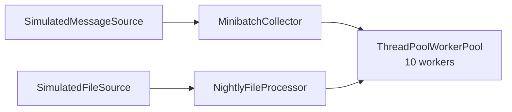

# MDS Data Engineering

A data processing system consisting of two parallel data pipelines and a bonus tournament scheduler.

## System Overview



Both pipelines run in parallel and share a single worker pool. The tournament scheduler runs independently as a separate script.

## Pipeline 1 - Minibatch Stream Processing

- Data source emits messages following a **Poisson distribution** at ~10 messages/min
- `MinibatchCollector` opens a 5-minute window on the first message and collects all messages that arrive within it
- Once the window closes, the batch is submitted to the worker pool as a `MinibatchTask`
- A new window opens immediately - batch creation does not wait for processing to complete
- The collector runs in its own background thread

## Pipeline 2 - Nightly File Processing

- `SimulatedFileSource` generates 100 files with sizes following an **exponential distribution**
- Files are packed into ~10MB buckets using `GreedyBucketingStrategy` before being sent to workers
- Processing small files individually is inefficient - bucketing amortizes the overhead
- The bucketing algorithm is encapsulated behind a `BucketingStrategy` interface, making it easy to swap for a different implementation
- The processor runs in its own background thread, parallel to the stream pipeline

## Bonus - Tournament Scheduler

A weekly game night scheduler for N players, T tables, and G players per table.

- Every round all tables are occupied simultaneously
- Each game produces one winner
- The overall tournament winner is the player with the most wins across all rounds
- Seating schedule is generated by a pluggable `SittingStrategy`

### Sitting Strategies

| Strategy | Description |
|---|---|
| `RandomSittingStrategy` | Randomly shuffles players each round |
| `SocialGolferStrategy` | Greedily minimizes repeated pairings - players who haven't sat together are prioritized |

`SocialGolferStrategy` uses a greedy heuristic: for each table, it selects players who have sat together the fewest times across previous rounds.

## Design Principles

- **Strategy pattern** - `BucketingStrategy` and `SittingStrategy` are both abstract interfaces. Concrete implementations are injected at runtime, making algorithms easy to swap without modifying the classes that use them.
- **Dependency injection** - all components receive their dependencies via constructor. No component creates its own dependencies internally.
- **Interface segregation** - `MessageSource`, `FileSource`, `WorkerPool`, `Task`, `BucketingStrategy`, and `SittingStrategy` are all narrow, focused interfaces.
- **Single responsibility** - each class has one job. The pool manages threads, tasks define work, processors orchestrate, strategies encapsulate algorithms.

## Running


### 1. Clone the repository

```bash
git clone https://github.com/vIadan/mds-de.git
cd mds-de
```

### 2. With Docker

```bash
# Build the image
docker build -t mds-de .

# Run the data pipelines
docker run mds-de

# Run the tournament scheduler
docker run mds-de python -m bonus.main

# Run tests
docker run mds-de pytest app/tests/ bonus/tests/
```

### 3. Locally

```bash
# Install dependencies
pipenv install

# Run the data pipelines
pipenv run python main.py

# Run the tournament scheduler
pipenv run python -m bonus.main

# Run tests
pipenv run pytest app/tests/ bonus/tests/
```

## Log Output

Each pipeline is color-coded in the terminal:

- **Yellow** - stream processing (MinibatchCollector, MinibatchTask)
- **Cyan** - nightly file processing (GreedyBucketingStrategy, FileBucketTask)
- **Green** - worker pool initialization
- **Magenta** - tournament scheduler
